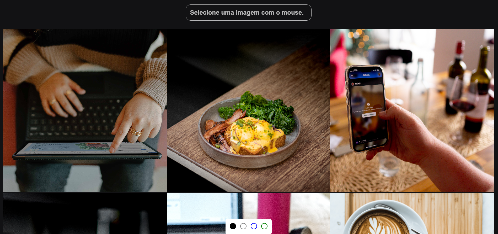
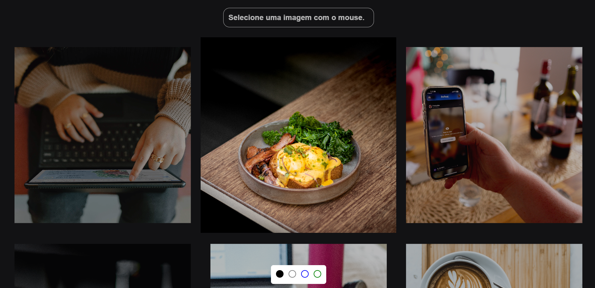

## Sobre o Projeto

Exercicio para compreender propriedades modernas do CSS e utilizar o seletor :has() entre outras propriedades, para desenvolver uma galeria aonde é possivel dar relevancia a uma imagem que é sobreposta com o mouse e um switch que altera o tema da pagina.
  

  

  

## Tecnologias

- [HTML 5](https://www.w3schools.com/html/)
- [CSS 3](https://developer.mozilla.org/pt-BR/docs/Web/CSS)
